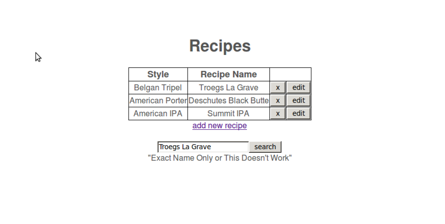
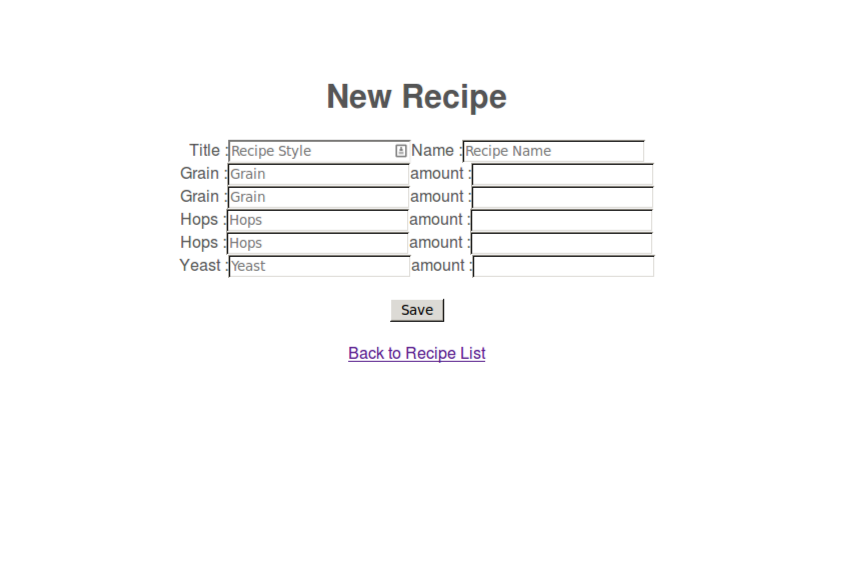

##Using Node, Express, and MongoDB to create a basic home brewing recipe site##


For this how-to guide, I decided to look into NodeJS.  I have played around with it before, but this was prior to starting a CS degree, and it went way over my head.  I though I would take another look at it and see if I can figure it out after getting a few CS classes under my belt.

I began by looking through the Node api, and although it seemed well documented, I didn't really get a feeling of a potential use for it.  I did a bit of googling and read through other tutorials.  I found many to-do lists and chat servers- both of which didn't seem to difficult to create.  I  wanted to complete a more substantial project with potential for future use.  I found a tutorial that uses [Node with ExpressJS and MongoDB](http://blog.ijasoneverett.com/2013/03/a-sample-app-with-node-js-express-and-mongodb-part-1/) to create a web page that can interact with an employee database.

This tutorial seemed to fit well with what we have been doing in class with PHP and MySQL, so I decided to further investigate. This tutorial is great and well-put together. I got the origional site up very quickly, but as soon as I tried to make changes, it began to fall apart.  I think part of that was just because Javascript is very new to me and I think there is room for a similar tutorial but one that really breaks the application down and shows how it works.  I hope that after following this tutorial you will have a good understanding of how to use Node to set up a site like this.

To do this I will be showing you  how to set up a very basic home brewing recipe website that will store data in MongoDB.  This is a project I've had in mind for a while and something that my group for CS494 is looking into from a UI prespective.

Just so you know what you're getting into, here is a quick recording of me walking through the site.  All of the source files can be found on my [GitHub](https://github.com/jdorweiler/beerDatabase)


##Getting Started##

The Node website has install instructions for Linux, Mac, and Windows.  For this tutorial I'll be using Ubuntu 12.04. I can't make any guarentees for other operating systems, but assuming you can get Node installed, everything else should be the same.

On Ubuntu, Node is very easy to install.  You can get Node and npm (Node Package Manager) installed by running:

`
$ sudo apt-get install nodejs
`

We will also be using ExpressJS and MongoDB.  Run the following commands to install Express

`
$ sudo npm install express -g
`

`
$ sudo npm install
`

Installing MongoDB is a bit more complicated, but still fairly easy.  Follow the instructions in this link to get your [database set up](http://docs.mongodb.org/manual/tutorial/install-mongodb-on-ubuntu/).  While you are there, it wouldn't be a bad idea to have a look at the [API](http://mongodb.github.io/node-mongodb-native/) before we get started.

**Hello World with Node and Express**

Now that you have everything set up, make a new folder for your project and move to that directory.  In this directory, you can initialize the skeleton structure of the site by running

`
express -c stylus
`

This also sets up your site to work with Stylus, which is a very simple css language.  We won't be using Stylus in this example, but it is standard to include it with Express.  And, it would be good to have when you perfect your site's appearance with some CSS.
The next step is to tell express that we are going to be working with MongoDB.  To do this, add a dependancy in the package.json file in the top level of your directory.  Do this by adding the line

`
"mongodb": ">= 0.9.6-7"
`

in the dependancy section.  Now running
<code>npm install -d</code> will set everything up to work with MongoDB.  We can test out Node and Express to see if everything works by running

`
$ node app.js
`

You should see a line on your terminal that says the Express server is listening on port 3000.  Open your favorite browser and go to the address 0:3000.


Before we move on, it would be helpful to look at where this page came from.  Open up the app.js file located in the top level of your directory.  You should see a file like the one below that was automatically created for you when you ran the Express command above.

```javascript
/**
 * Module dependencies.
 */

var express = require('express');
var routes = require('./routes');
var user = require('./routes/user');
var http = require('http');
var path = require('path');

var app = express();

// all environments
app.set('port', process.env.PORT || 3000);
app.set('views', path.join(__dirname, 'views'));
app.set('view engine', 'jade');
app.use(express.favicon());
app.use(express.logger('dev'));
app.use(express.json());
app.use(express.urlencoded());
app.use(express.methodOverride());
app.use(app.router);
app.use(require('stylus').middleware(path.join(__dirname, 'public')));
app.use(express.static(path.join(__dirname, 'public')));

// development only
if ('development' == app.get('env')) {
  app.use(express.errorHandler());
}

app.get('/', routes.index);
app.get('/users', user.list);

http.createServer(app).listen(app.get('port'), function(){
  console.log('Express server listening on port ' + app.get('port'));
});
```


You can think of this file and the brains for the server.  The the function at the bottom `http.createServer` is where the actual Node server is started.  Above that, we set the port using

```javascript
app.set('port', process.env.PORT || 3000);
```

Let's take a look at the routes.  The routes are going to be the functions that begin with `app.get()` or `app.post()`.  When the server gets a GET or POST request, we need to know what page to feed back to the browser.  This is where the routes are necessary.

````javascript
app.get('/', routes.index);
````

This line tells Node what to do when we have a GET request for the page located at 0:3000/ or our index page.  Specifically, it is sending the page `routes.index` back to the browser.  Inside the routes.index file you will see the following function.

```javascript
exports.index = function(req, res){
  res.render('index', { title: 'Express' });
```

This is using one of the [Express API](http://expressjs.com/api.html#app.render) functions called render `render('index', { title: 'Express' }`.  This simple line of code is more complex than I originally thought.  After much reading, my best explanaio ins that this renders a HTML string which is called a view in the API.  By default, Express looks in the `views` folder for this index page and sends it a title called "Express".  In the index file within the views folder, there is simple html page that looks like this:

```html
extends layout
block content
  h1= title
  p Welcome to #{title}
```

Note that this page is actually written in [Jade](http://jade-lang.com/) which is the default HTML language used by Express.

The `export.index` is necessary because Node does not allowing sharing of variables between files.  By adding export, you are letting Node know that this variable can be used by other functions in other files.  In this case, the origional app.get function in our app.js file will serve us the HTML content.  Now that we have covered the basics of working with Node and Express, let's begin interacting with the MongoDB database.


##Interacting with MongoDB##

We need to make a few changes to our app.js file so that it will work with the database.  The way it is set up right now we are only sending static pages back to the browser.  We will add a few new functions to the app.js file that will call functions in a separate file that handles all the interaction with th edabase.  First we need to add a few lines in app.js.  In this case, I am going to be using a database called `RecipeProvider`.  We will need to add in an additional dependancy for the database.

`RecipeProvider = require('./recipeProvider').RecipeProvider;`

This dependency tells Node to use module called recipeProvider, which we will write next.  In the top level of your directory, make a file called recipeProvider.js.  Note that this file name is case-sensitive and must match the file you loaded above using `require()`.

Here is a link the complete [recipeProvider.js](https://github.com/jdorweiler/beerDatabase/blob/master/recipeProvider.js) file.  I will walk through this process in steps below.

The first thing we need to do is set up our database.

```javascript
var Db = require('mongodb').Db;
var Connection = require('mongodb').Connection;
var Server = require('mongodb').Server;
var BSON = require('mongodb').BSON;
var ObjectID = require('mongodb').ObjectID;
```
It is interesting to note that the[ ObjectID](http://docs.mongodb.org/manual/reference/object-id/) which is a function in the MongoDB API that allows us to create and use the ID strings that are used for keys in the database.  Above that line is the require statement for the [BSON ](http://http://docs.mongodb.org/manual/core/document/) API from MongoDB.  The database stores things in a format called BSON which is for our purposes is the same thing as JSON.  Here is an example of what a single beer recipe might look like in the database:

```javascript
{ _id: 53063adaca24b99c255d4f09,
  title: 'Belgan Tripel',
  name: 'Troegs La Grave',
  grain: [ [ 'Pilsner 2 Row', 'Munich' ], [ '12 lbs', '2 lbs' ] ],
  hops: [ [ 'Saaz', 'Willamette' ], [ '2 oz', '2 oz' ] ],
  yeast: [ 'Trappist', '1 vial' ] }
  }
```
Then we set up a RecipeProvider object that will connect us to the database.

```javascript
// connect to the database
RecipeProvider = function(host, port) {
  this.db= new Db('node-mongo-recipe', new Server(host, port, {safe: false}, {auto_reconnect: true}, {}));
  this.db.open(function(){});
};
```


##Setting up our HTML pages##

Before we get too far, let's go set up our HTML pages.  For this demo, we will have an index, new recipe, and edit recipe pages.  Make a new file in the `views` folder called `index.jade`  Here is what our completed index page will look like.

```javascript
extends layout
head
body
  block content
    h1= title

	#recipes
	  div
	    table 
		  thead
		    tr
			  td Style
			  td Recipe Name
			tr 
			- each recipe in recipes
			    tr
					td= recipe.title
					td= recipe.name 
					td
						div
							form( method="post", action="/recipe/:id/delete")
							input(name="_id", type="hidden", value=recipe._id.toHexString()) 
							input(id="edit", value="x", type="submit" style="float: right") 
					td
						div
							form( method="post", action="/recipe/:id/edit")
							input(name="_id", type="hidden", value=recipe._id.toHexString()) 
							input(id="edit", value="edit", type="submit" style="float: right") 

		a(href="/recipe/new")= "add new recipe"
```

Don't forget that for this demo, we are using Express with Jade as our HTML template language.  All of the typical rules of HTML still apply, but with Jade you don't need to use closing tags.  Jade is however whitespace sensitive, so you must indent anything that would be in that particular tag.  It also distinguishes between tabs and 4-spaces.  You must be consistent throughout the page, so choose one style and stick with it.

A neat discovery with Jade is that you can use loops and conditionals right inline with the other code.  For example see the line:

```javascript
- each recipe in recipes
```
Use the `-` to tell Jade that you want to use a loop or conditional, and then no braces are needed.  In this page, we are creating a table which will have two header cells that display the recipe title and name.  Below the table, we are going to loop through an array called recipes. For each recipe in the array, we will print out the title and name in separate cells.  To the right of each recipe, we will have buttons that will allow you to delete and edit a recipe.  At the bottom of the page, we leave a link to the new recipe page.  While not functional yet, here is a preview of what the front page will look like once finished.



Now that we have the index page completed, let's make the add new recipe page.  Make a new file called `new_recipe.jade` in your views folder.  Here is what our new recipe page will look like.

```javascript
extends layout
block content
    h1= title
    div.newrecipe
        form( method="post")
            table
                tr
                    div
                        span.label Title :
                        input(type="text", name="title" placeholder="Recipe Style", id="editRecipeTitle")
                        span.label Name :
                        input(type="text", name="name" placeholder="Recipe Name", id="editRecipeName")
                tr
                    div
                        span.label Grain :
                        input(type="text", name="grain" placeholder="Grain", id="editRecipeGrain")
                        span.label amount :
                        input(type="text", name="grain-ammount" placeholder="", id="editRecipeAmount")
                    div
                        span.label Grain :
                        input(type="text", name="grain" placeholder="Grain", id="editRecipeGrain")
                        span.label amount :
                        input(type="text", name="grain-ammount" placeholder="", id="editRecipeAmount")
                tr
                    div
                        span.label Hops :
                        input(type="text", name="hops" placeholder="Grain", id="editRecipeGrain")
                        span.label amount :
                        input(type="text", name="hops-ammount" placeholder="", id="editRecipeAmount")
                tr
                    div
                        span.label Hops :
                        input(type="text", name="hops" placeholder="Grain", id="editRecipeGrain")
                        span.label amount :
                        input(type="text", name="hops-ammount" placeholder="", id="editRecipeAmount")
                tr
                    div
                        span.label Yeast :
                        input(type="text", name="yeast" placeholder="Grain", id="editRecipeGrain")
                        span.label amount :
                        input(type="text", name="yeast-ammount" placeholder="", id="editRecipeAmount")

                #editRecupeSubmit
                br
                input(type="submit", value="Save")
        br
        a(href="/")!= "Back to Recipe List"
```

This page will render a form with a box for a recipe title, name, 2 grains, 2 hops, and 1 type of yeast.  Take a look at the names for each of the input boxes.  We will use these to create our JSON array that will be sent to the database. Here is the actual JSON data that will be sent after we submit the form:

```javascript
{ title: 'New Beer Style',
  name: 'Recipe Name',
  grain: 
   [ [ '1 Grain Name', '2 Grain Name' ],
     [ '1 Grain Amt', '2 Grain Amt' ] ],
  hops: [ [ '1 Hops', '2 Hops' ], [ '1 Hops Amt', '2 Hops Amt' ] ],
  yeast: [ 'Yeast Name', 'Yeast Amt' ] }
```

##Setting up the routes##

Now that we have the index and new recipe pages ready, let's set up the routes for the site in the `app.js` file.  The complete app.js file is a bit long, so I'll link the full version here: [app.js](https://github.com/jdorweiler/beerDatabase/blob/master/app.js).

Think back to the hello world example at the beginning of the tutorial, and you will recognise that `app.get` functions.  We will use the same idea to create routes for the site by definiing different `app.get` and `app.post` functions.  Let's look at the route for our new index page. 

```javascript
app.get('/', function(req, res){
	recipeProvider.findAll(function(error, recip){
		res.render('index', {
			title: "Recipes",
			recipes:recip
		});
	});
});
```

The function above will use our recipeProvider object, which we connected to the database using:

```javascript
var recipeProvider= new RecipeProvider('localhost', 27017);
```
This function will be called whenever we have a GET request to the `'/'` address.  When this function is called, it will use the `findAll()` method (which we still have to write, see next section) which will return our recipes from the database.  Then we use `render()` just like we did in the hello world page to render our `index.jade` page and send it the recipes.  This will produce the front page with a table of recipes that I showed you earlier.

If you want to test out your index page right now, you can do so by first starting MongoDB in a separate terminal using

`
$ sudo mongod
`

and then running your app.js file

`
$ node app.js
`

If that worked you should now have a blank recipe page.

Our index page is pretty boring without any recipies on it, so let's write the routes to handle the `recipe_new.jade` page.  First we need to write the function that handles a GET request to the page since we are going to go to the page through the normal link at the bottom of the index page.  This follows the same idea as the other route fuctions.  A GET request to this page will call the function which will render the recipe_new.jade page and send the title "New Recipe".

```javascript
app.get('/recipe/new', function(req, res){
	res.render("recipe_new", {
		title: "New Recipe"
	});
});
```

More interesting is the function we need to handle a POST from the new recipe page.  Remember that we are submitting the data as a form, so we need a way to handle the POST.  Inside of this function, we are going to call the `save()` method (we still need to write this) and we will send the save method our JSON data, which we will then format using this fuction.

```javascript
app.post('/recipe/new', function(req, res){
	recipeProvider.save({
		title: req.param('title'),
		name: req.param('name'),
		grain: [req.param('grain'), req.param('grain-ammount')],
		hops:  [req.param('hops'), req.param('hops-ammount')],
		yeast: [req.param('yeast'), req.param('yeast-ammount')]
	}, function(error, docs) {
			res.redirect('/')
	});
});
```
Notice how the formatting in this function matches the JSON data I showed you earlier.  We can use `req.param` and the name from our form to get each of the values and put them into the proper format.  After the save function returns, it redirects us back to the index page (using a GET) and renders our new recipe in the table.


##Interacting with the database##

Before our index and new recipe pages will work, we must write the two methods getAll and Save to work with MongoDB.  These will be kept in the recipeProvider.js file in the top level of your directory.  To get the two pages working, we will need two methods for getting a collection

```javascript
// internal functions use to get a collection from the database
RecipeProvider.prototype.getCollection = function(callback){
	this.db.collection('recipes', function(error, recipe_collection) {
		if(error) callback(error);
		else callback(null, recipe_collection);
	});
};

// get all the recipes in the database
RecipeProvider.prototype.findAll = function(callback){
	this.getCollection( function(error, recipe_collection) {
		if(error) callback(error)
		else{
			recipe_collection.find().toArray( function(error, results){
				if(error) callback(error)
				else callback(null, results)
			});
		}
	});
};

RecipeProvider.prototype.save = function(recipes, callback) {
    this.getCollection(function(error, recipe_collection) {
      if( error ) callback(error)
      else {
        recipe_collection.insert(recipes, function() {
          callback(null, recipes);
        });
      }
    });
};
```
Just a note about the terminology used with MongoDB since it differs from SQL:  tables are called collections and rows are called documents.

Before using any of the methods, we need to get the collection using `getCollection()`.  This returns a collection instance with the name "recipes".  In the findAll function, we get the collection and then use the `find()` method to return all documents in the collection. Now that we have our recipes in an array, we return the recipe array (called results) to the calling function, which is this case is findAll() funciton that renders our index page back in the app.js file.

```javascript
app.get('/', function(req, res){
	recipeProvider.findAll(function(error, recip){
```
We then send the results to the index page, which is now an array called "recipes".  Hopefull your index.jade file will start to make a bit more sense now.  Take a look at the lines below.  Now that the recipes are sent to the index file, we can display the values using:

```html
recipe.title
recipe.name
```
And we can loop through the enteries in the recipe array using:

```javascript
- each recipe in recipes
```
Another important thing to pay attention to in the index file is the line

```javascript
input(name="_id", type="hidden", value=recipe._id.toHexString()) 
```

Since we are going to have buttons for editing and deleting a single recipe, we need a way to store its id.  By setting the value of a hidden input to store the id, we can pass it using a POST request. 

**Adding new entries**

Now we still need to add some recipes to the database, so let's write function to handle that.  Take a look above at the `RecipeProvider.prototype.save()` function.  Remember that this function is going to be called by the functoin `app.post('/recipe/new'` in the app.js file.  This was the function above in the "setting up routes" section where we built our JSON data to send to the database.  This is where all that hard work is going to pay off.  We just need to pass the JSON data to the `insert()` method and our new recipe is stored.

If you start up your page again (Note: don't forget to restart Node after changing any js files) and this time click on the link to add a new recipe you should get this page:



We can finish off the site by adding in the routes for the edit and delete buttons on the index page.  When we click on the delete (X) button on the front page, it will make a POST request to /recipe/:id/delete.  The name of the address isn't really important since we won't even be rendering this page.

```javascript
app.post('/recipe/:id/delete', function(req, res){
	recipeProvider.delete(req.param('_id'), function(error, docs){
		res.redirect('/')
	});
});
```
Instead, with this route we will call the delete method from the recipeProvider.js file passing it the id of the document we want to remove.  Our callback is then just a redirect back to the index page.  The rest of the functions and routes are very similar to the ones I've already walked through. so I'll leave those alone.

Before we finish up, there are a few tricky areas I encountered while working on this project.  Hopefully this tutorial will save you hours of debugging.  The first problem I had was trying to get a single document using the id.

```javascript
{_id: recipe_collection.db.bson_serializer.ObjectID.createFromHexString(recipeId)}
```
I assumed that I could just send it the id number and it would find or remove that document, but unfortunatly that wasn't the case.  I'm still not sure what it needed, but I tested it by just passing the id and it does not work this way.

The next problem I had occurred when searching for documents using the `find()` function.  An example of this issue can be found in the search function in recipeProvider.js.

```javascript
RecipeProvider.prototype.search= function(searchterm, callback){
	this.getCollection( function(error, recipe_collection) {
	recipe_collection.find({name: searchterm}).toArray(
		function(error, recipe){
			callback(null, recipe)
		});	
	});
}
```
I though that find() would return the data in an array or as JSON, but instead it returned a pointer to the location of the results.  You have to actually use the `toArray()` to move the pointer to the location of the data which is an array.  I finally made this discovery after digging through the [API docs](http://docs.mongodb.org/manual/reference/method/cursor.toArray/)

And my last debugging tip:  Don't forget to restart Node after making changes to the javascript files! (that one got me a few times).

